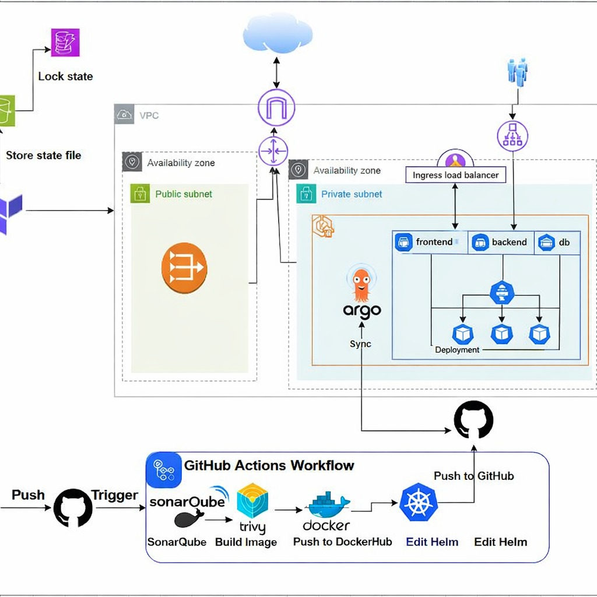

# DevOps Team Manager 🚀

A full-stack **Python-based application** designed and deployed on **Kubernetes**, following real-world **DevOps best practices**.  
The project demonstrates microservices architecture, secure networking, Helm-based deployments, and full observability using **Prometheus and Grafana**.

---

## 🧱 Architecture Overview

- **Frontend**  
  - Python application  
  - Exposed via Kubernetes Service & Ingress

- **Backend**  
  - Python Flask REST API  
  - Handles business logic and API requests

- **Data Layer**  
  - PostgreSQL – persistent data storage  
  - Redis – caching and fast data access

- **Infrastructure**  
  - Kubernetes  
  - Helm (single umbrella release)  
  - Network Policies  
  - Monitoring with Prometheus & Grafana

---

## 📁 Project Structure

```
.
├── frontend/
├── backend/
├── db/
├── k8s/
│   ├── frontend/
│   ├── backend/
│   ├── db/
│   └── network-policies/
├── helm/
│   └── devops-app/
└── README.md
```

---

## 🚀 Deployment Guide (Minikube)

### Start Minikube
```bash
minikube start --driver=docker --cni=cilium
```

---

### Enable Ingress Controller
```bash
minikube addons enable ingress
```

---

### Get Minikube IP
```bash
minikube ip
```
Example:  
```
192.168.49.2
```

---

### Update Hosts File
```
192.168.49.2 frontend.nti.com
192.168.49.2 backend.nti.com
```

---

### ⚙️ Application Deployment (Helm)
This project uses one Helm umbrella chart with a single release name: `DevOps`.
```bash
helm upgrade --install DevOps ./helm/devops-app \
--namespace devops \
--create-namespace
```

---

### Verify Deployment
```bash
kubectl get pods -n devops
kubectl get svc -n devops
kubectl get ingress -n devops
```

---

### 🌐 Access the Application
- **Frontend:** http://frontend.nti.com  
- **Backend:** http://backend.nti.com

---

### 🔒 Network Policies
```bash
kubectl get networkpolicies -A
kubectl describe networkpolicy <policy-name> -n devops
```

---

### 📊 Monitoring (Prometheus & Grafana)

#### Add Helm Repository
```bash
helm repo add prometheus-community https://prometheus-community.github.io/helm-charts
helm repo update
```

#### Install Monitoring Stack
```bash
kubectl create namespace monitoring

helm upgrade --install monitoring \
prometheus-community/kube-prometheus-stack \
-n monitoring
```

#### Verify Monitoring
```bash
kubectl get pods -n monitoring
kubectl get svc -n monitoring
```

#### 📈 Access Grafana (Port Forward)
```bash
kubectl port-forward svc/monitoring-grafana 3000:80 -n monitoring
```
Open: http://localhost:3000

#### Grafana Credentials
- **Username:** `admin`  
- **Password:**
  ```bash
  kubectl get secret monitoring-grafana \
  -n monitoring \
  -o jsonpath="{.data.admin-password}" | base64 -d
  ```

#### 🔍 Prometheus Access (Optional)
```bash
kubectl port-forward svc/monitoring-kube-prometheus-prometheus 9090:9090 -n monitoring
```
Open: http://localhost:9090

---

### 🛠 Monitoring & Troubleshooting Commands

#### Cluster Status
```bash
kubectl cluster-info
kubectl get nodes
kubectl get namespaces
```

#### Pod & Resource Monitoring
```bash
kubectl get pods -A
kubectl top nodes
kubectl top pods -A
```

#### Logs & Debugging
```bash
kubectl logs <pod-name> -n devops
kubectl describe pod <pod-name> -n devops
```

#### Helm Management
```bash
helm list -n devops
helm status DevOps -n devops
helm history DevOps -n devops
helm rollback DevOps 1 -n devops
```

---

### ✅ Key DevOps Practices Demonstrated
- Kubernetes multi-tier architecture  
- Secure networking with Network Policies  
- Helm umbrella chart deployment  
- Observability with Prometheus & Grafana  
- Production-style monitoring & troubleshooting  
- Clean upgrade and rollback strategy

---

### 📌 Future Enhancements
- Expose `/metrics` endpoint for Python services  
- Custom Grafana dashboards  
- Alerting rules (CPU, memory, pod restarts)  
- CI/CD pipeline integration

---

### 🖼️ Visual Overview

#### System Architecture


#### Deployment Diagram

